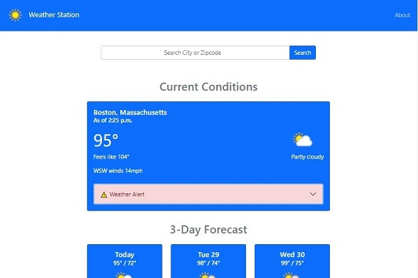

#  Weather Staion
A Django weather web-application that shows the current conditions as well as a three day forecast for a given location

## About
This weather application is powered by the free version of [Weather API](https://www.weatherapi.com/). The frontend is built using [Bootstrap](https://getbootstrap.com/), while the back end is powered by the [Django](https://www.djangoproject.com/) framework. Users can search for weather information by entering any of the following into the search bar:
* City Name
* US Zipcode
* UK Postcode
* Canada Postcode
* 3 Digit Airport Code
* Latitude & Longitude

Successful searches will return the current conditions, as well as three-day forecast for the given location. 

#### Current Conditions Data Includes:
* Location
* Time of search
* Current Temperature
* Current Feels-Like Temperature
* Description of Conditions
* Wind Speed & Direction
* Special Weather Alerts (if applicable)

#### 3-Day Forecast Data Includes:
* Date
* Hi/Low Temperatures
* Description of Conditions
* Sunrise Time
* Sunset Time

## Inspiration
This project was inspired by a [Codemy](https://codemy.com/build-weather-app-python-django/) tutorial course from [John Elder](https://twitter.com/flatplanet). The tutorial project included a web-applicatoin that displayed air quality conditions for a given zipcode, utilizing the [AirNow](https://docs.airnowapi.org/) API. 

## Technologies
This project was developed using:

* Bootstrap 5.0.2
* Python 3.9.2
* Django 3.2.4

## Meta
[Nathan Brown](https://www.nathanabrown.com) - [@_N8_Brown](https://twitter.com/_N8_Brown) - contact@nathanabrown.com 

https://github.com/N8Brown/weather_app
https://www.weatherstation.nathanabrown.com/
